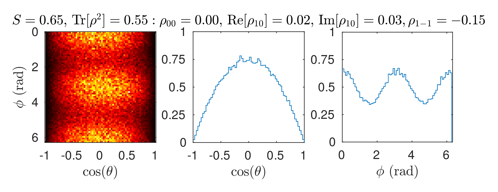

# CG-helicity

A Matlab package for arbitrary two-body spin correlations using Jacob-Wick helicity amplitudes, together with basic SU(2) angular decomposition functions.

mikael.mieskolainen@cern.ch, 2017
